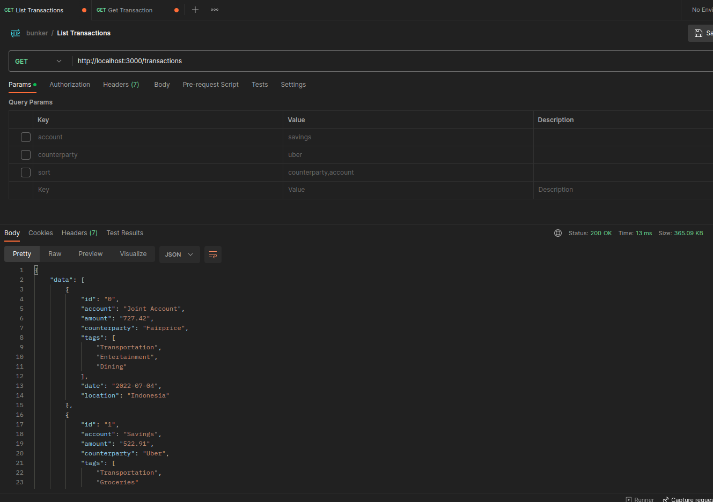
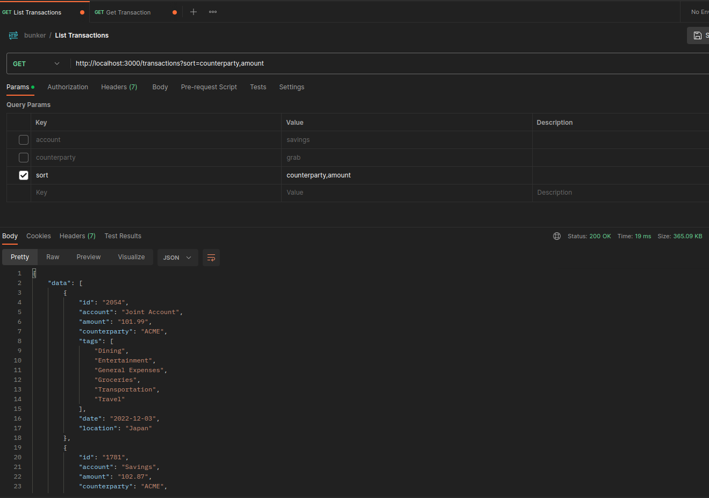
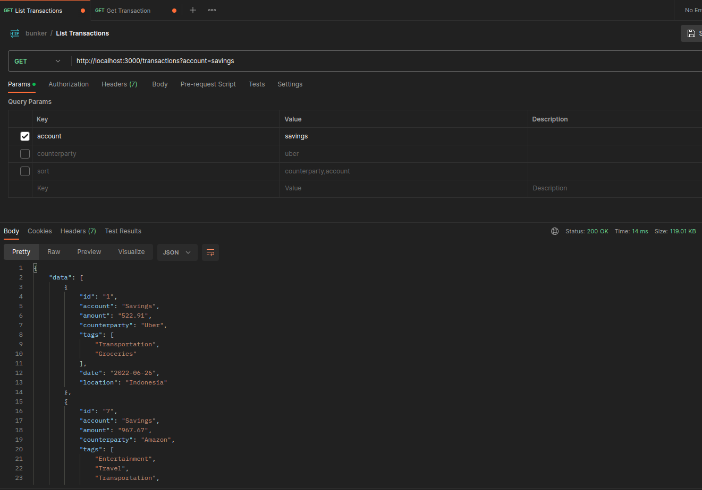
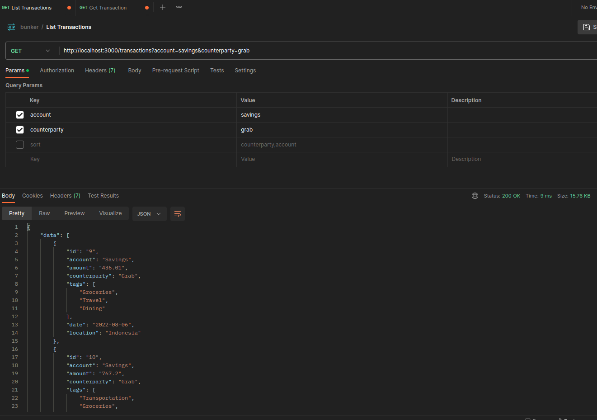
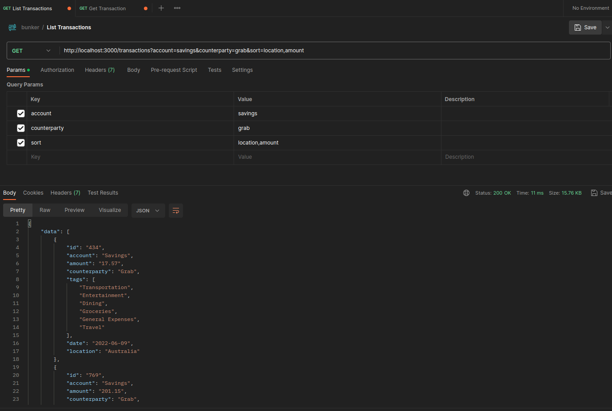
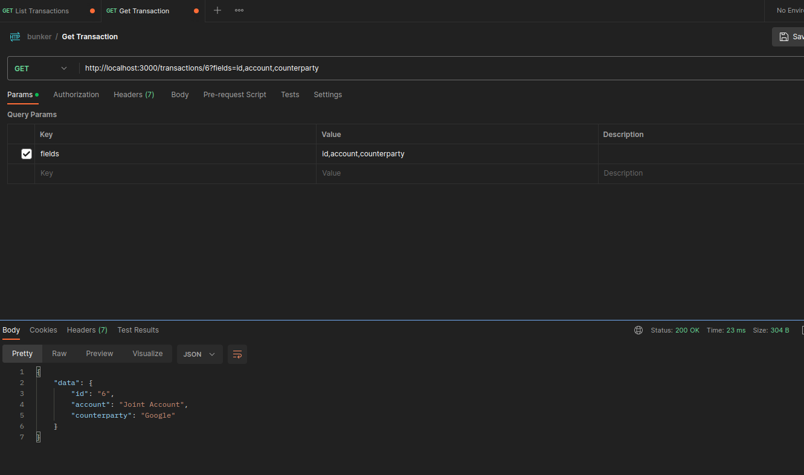

# Transaction API

The goal of this exercise is to design a read-only API (REST) that returns one or more records from a static set of transaction data.

Requirements:

- list transaction data via API `GET` Request
  - Filter by one or more fields/attributes (e.g. /transactions?tags=Dining,Travel&counterparty=Google)
  - Sort by one or more fields/attributes (e.g. /transactions?sort=counterparty)
- Fetch a single record via `GET` request
  - Stretch goal: return a sparse field, (e.g. /transactions/32?fields=amount,tags)

## Requirements

This project is developed with:

- Node 18

## API Documentation

[Postman API Documentation](https://documenter.getpostman.com/view/3021947/2s93sgWVoa#b0e695ed-eb5e-4b77-965a-4939f5683139).

## Installation

Clone the project

```bash
git clone git@github.com:appleinautumn/bunker-take-home-exercise.git
```

Go to the project directory

```bash
cd bunker-take-home-exercise
```

This service contains a `.env.example` file that defines environment variables you need to set. Copy and set the variables to a new `.env` file.

```bash
cp .env.example .env
```

Install the dependencies

```bash
npm install
```

Compile the typescript code and start the app

```bash
npm run dev
```

## Database

The database file is simulated via `data/data.csv` file. When the application starts, the file will be loaded to memory.

## Testing

Test the service with `npm test`.

```bash
$ npm test

> take-home-exercises@0.0.0 test
> NODE_ENV=test mocha --timeout 7000 --exit './test/**/*.test.js'


  Controller Unit Test
    Test index method
      ✔ should list transactions
      ✔ should get a transactions by id
      ✔ should get a transactions by id with no fields specified
      ✔ should get a transactions by id with fields: id
      ✔ should get a transactions by id with fields: id, account
      ✔ should get a transactions by id with fields: account, amount
      ✔ should get a transactions by id with fields: amount, counterparty, tags
      ✔ should get a transactions by id with fields: id, account, amount, counterparty, tags, date, location
      ✔ should capture an error on getting a record when the repository throws an error

  Test getValidFields for sorts
    ✔ should empty array for empty sort string
    ✔ should return empty array for all invalid fields (aa,bb,cc)
    ✔ should return 1 valid field in an array and exclude invalid fields (aa,bb)

  Test getValidFields for sparse fields
    ✔ should return complete valid fields for empty field string
    ✔ should return complete valid fields for all invalid field string
    ✔ should return 1 valid field for 1 valid and other invalid string

  Test formatTransactionWithFields
    ✔ should return an empty object for empty fields
    ✔ should return an empty object for all invalid fields
    ✔ should return valid fields and exlude invalid fields


  18 passing (214ms)
```

## Deployment

### Without Docker

Follow the Installation instruction above.

### With Docker

Build the image

```bash
docker build -t bunker-test1 .
```

Run the container

```bash
docker run -d --name bunkertest1 -p 3001:3000 --network=host --env-file=.env bunker-test1
```

## Screenshots

List transactions



List transactions with multiple sorts



List transactions with 1 filter



List transactions with multiple filters



List transactions with multiple filters and multiple sorts



Get a transaction by id with specified sparse fields



## Feedback

- I've been a software engineer for quite some time. But I've never used Typescript in a working environment. I can build this API quickly with just Javascript, but with Typescript, I found myself having a tough time integrating with Express.
- `data` directory is the place where I store the csv file. I'm simulating the database with this file.
- `dist` directory is where all the compiled Typescript to Javascript files are located.
- `src` directory is where all the Typescript files are located.
- `test` directory is where all the tests files are located. Yes this is pure Javascript given the limited time. But the app itself is all written with Typescript.
- `src/app.ts` is the main entry point.
- `src/routes` is the route.
- `src/controllers` is to store handlers for "listing" and "getting" Transaction routes. It has one dependency: the repository layer (`#repository`). The controller also contains 2 helper functions: `getValidFields` and `formatTransactionWithFields`. Function `getValidFields` is to make sure the entered "sparse fields" or "sort fields" are of valid values. Function `formatTransactionWithFields` is to return the Transaction record to contain only specific fields.
- `src/middlewares` is where middlewares are. Currently only 1 file and it extends the express object to have "success" handler so that we have a success template for happy path.
- `src/models` is where I define the Transaction interface.
- `src/repositories` is repository layer. This is where our application gets the data from. Normally a "Service" layer will interact with this file, but this API is too small to need this layer.
- In the repository layer, the storage of the database file is simulated via a hash table of `<String, Object>` (i.e. private variable `#db`). So that when retrieving a specific Transaction by id (`/transactions/:id`), we can access to that specific record directly (an `O(1)` operation).
- In the repository layer, the listing of the records (i.e. `/transactions`) will translate the hash table to an array of records. Then only filtering and sorting logic are applied. Usually the filtering and sorting logic is done at the database layer, but since I'm using the in-memory database, I have to do it manually.
- I cannot make the integration test work (with supertest library) because the entry point (http server) is at app.js. Usually it's on separate file, but with limited time, I cannot find the solution. I'm not sure why, but there's less resources on the net.
- Unit testing on controller with stubbing repository layer is working fine. This is the strength of dependency injection.
- I cannot stub repository layer because the repository layer accepts "filename", not the usual database service with its own methods that sinon can stub. If I were to use a real database, I'd be able to stub it.
- This is my first attempt to write an app in Typescript. I think it's really a fun project though I can't say if I prefer this better than other statically typed languages like Kotlin or Go. Most of the issues I have with Typescript is finding out what an existing popular library returns and how to deal with that, like converting to the usual Javascript object. I have bought udemy course on Nest.js but I haven't had the chance to watch it unfortunately.
